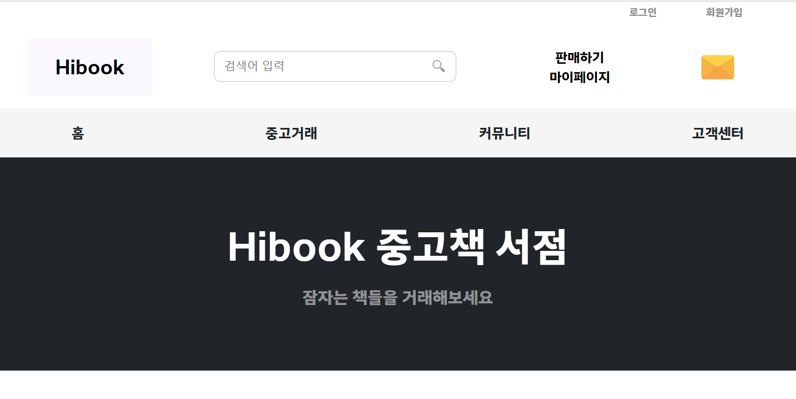

# ◆ HiBook 중고책 거래 사이트 ◆

## ◆ 호스팅 사이트 : http://itwillbs7.cafe24.com/teamProject/main.do ◆
### ◆ 사용 툴 : eclipse, Workbench
### ◆ 사용 DB : MySQL v8.0.17
### ◆ 사용언어 : JAVA, JSP, AJAX, JQUERY, HTML, CSS, JAVASCRIPT
### ◆ 주제 : JAVA를 이용하여 MVC Model2의 패턴으로 웹 서비스를 직접 구현

---

### ◆ 프로젝트 기간 : 1월 30일 ~ 2월 24일
### ◆ 담당 역할 : 회의진행, 일정관리, 발표진행
### ◆ 담당 기능 : 커뮤니티 게시판(공지,자유,도서리뷰), 댓글 

---

## <개발 코드>

### ◆ 게시판 및 댓글  ◆

* Model,Controller

  * [게시판 JAVA 파일](https://github.com/Baek0218/HiBook_Project/blob/cafe24/teamProject/src/main/java/com/itwillbs/board/action/)
  
  * [게시판 DAO,DTO 파일 ](https://github.com/Baek0218/HiBook_Project/blob/cafe24/teamProject/src/main/java/com/itwillbs/board/db/)

  * [댓글 JAVA 파일](https://github.com/Baek0218/HiBook_Project/blob/cafe24/teamProject/src/main/java/com/itwillbs//boardCommentaction/action)

  * [댓글 DAO,DTO 파일 ](https://github.com/Baek0218/HiBook_Project/blob/cafe24/teamProject/src/main/java/com/itwillbs/boardComment/db/)

 
* View
  * [게시판 화면 + 댓글 ](https://github.com/Baek0218/HiBook_Project/blob/cafe24/teamProject/src/main/webapp/board/)

---
